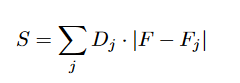

# Spectrum Allocation Algorithm

## Overview

Spectrum allocation refers to the process of assigning portions of the electromagnetic spectrum to various services or users for different purposes such as telecommunications, broadcasting, navigation, and scientific research. Given that the electromagnetic spectrum spans a wide range of frequencies, from radio waves to gamma rays, and is a finite resource, efficient management is crucial.

This project aims to develop an algorithm for spectrum allocation that meets specific requirements and optimizes the use of the electromagnetic spectrum.

## Requirements

The algorithm should meet the following criteria:

- **Minimum Interference**: Ensure minimal interference between allocated channels.
- **Minimum Bandgap**: Maintain a specified minimum bandgap between channels to prevent overlapping and interference.
- **Speed and Efficiency**: The algorithm must be fast and efficient in processing and allocation.
- **Special Channels**: Exclude certain channels as specified by the requirements.

## Objective

The main objective of this project is to design an efficient and effective spectrum allocation algorithm that adheres to the above requirements while optimizing spectrum utilization and minimizing interference.

  
-**F** : Decision variable representing the channel to be
assigned to the new location. 
-**Fj**: Existing channel assignments at the jth location (1 <
j < n). 
-**Dj**: Weights representing the distance between the new
location and the jth location. Higher Dj values indicate
a greater impact on interference if F and Fj are close. 

## Dataset

The dataset used for testing and validation of the algorithm was generated using:

- **Poisson Distribution**: For modeling the number of already allocated channels.
- **Uniform Distribution**: For modeling the random placement of channels.

